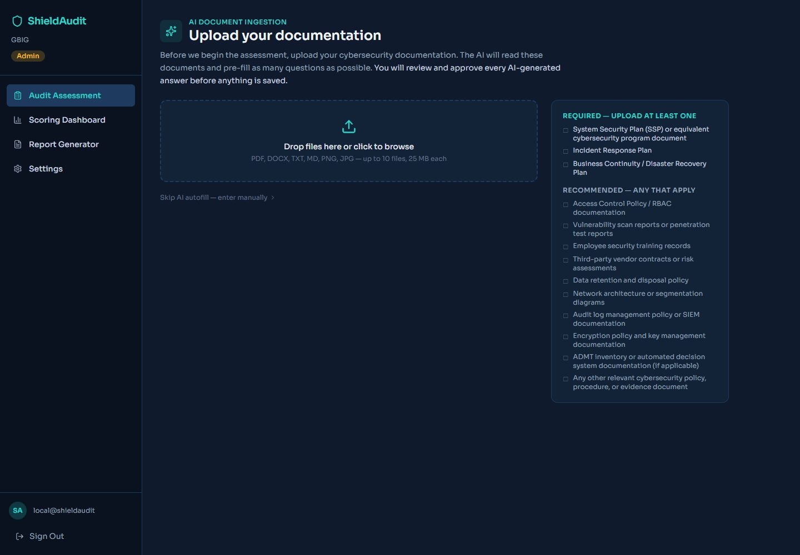
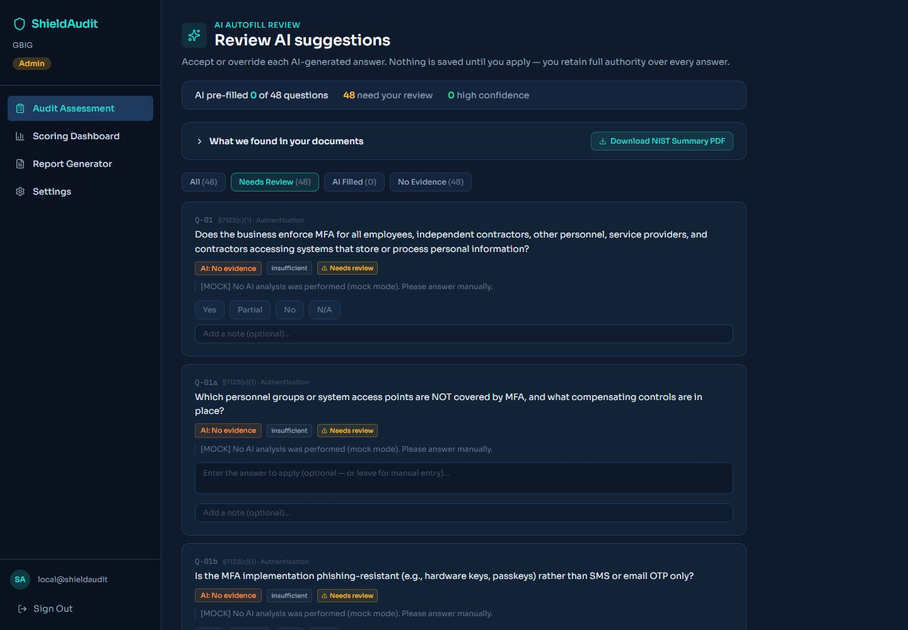
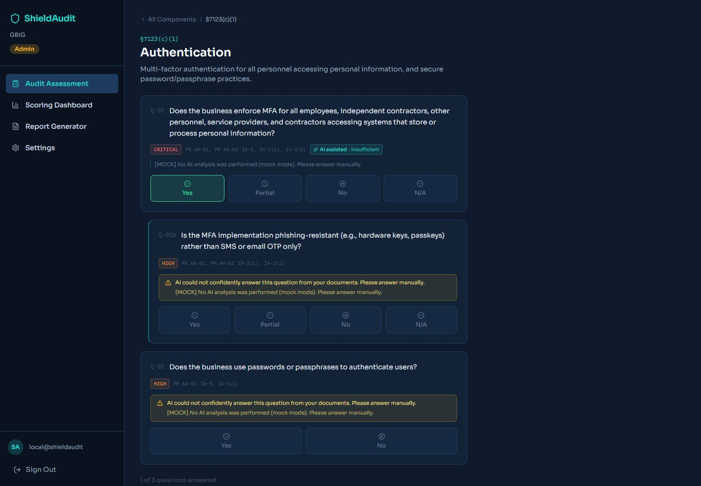
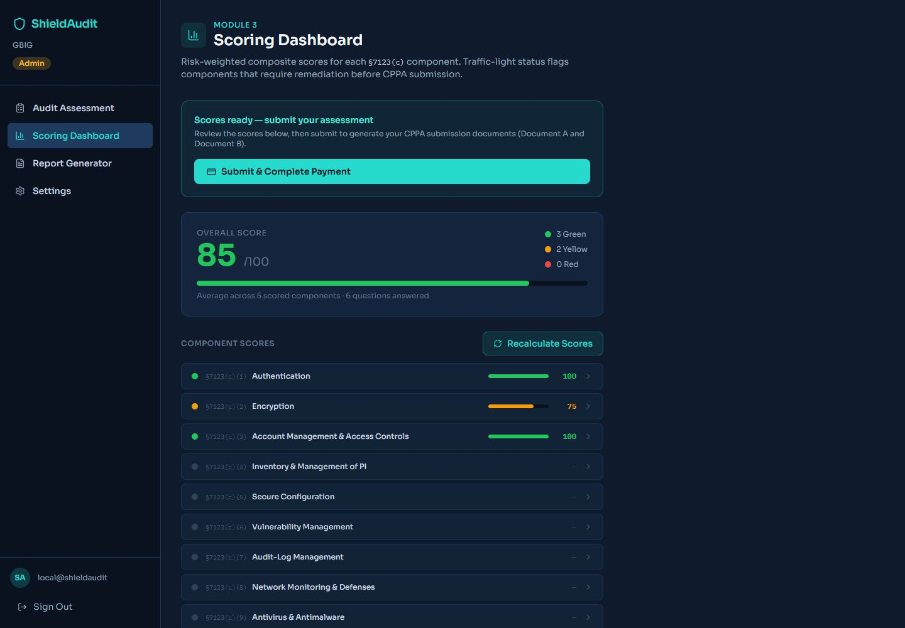
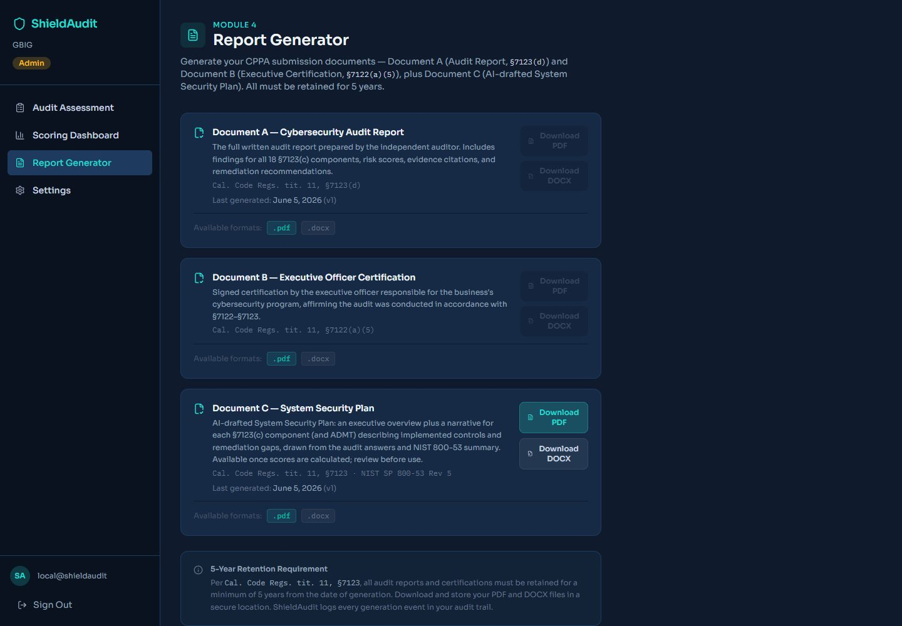

# ShieldAudit — Product Demo

ShieldAudit is a **CCPA cybersecurity-audit SaaS platform** that walks a California‑covered
business through an independent annual audit under **Cal. Code Regs. tit. 11, §§7120–7124**
(effective Jan 1, 2026).

The screenshots below show the end‑to‑end flow, including the **AI document‑ingestion + autofill**
layer (ADD‑17) and the **AI‑drafted System Security Plan**. Everything here runs against the real
app; the AI runs in mock mode so the flow works with no API key (set `ANTHROPIC_API_KEY` for live
analysis).

---

### 1. AI Document Ingestion — upload your documentation
The auditor uploads cybersecurity documentation (SSP, IR plan, BCP/DRP, policies, scans…). The AI
reads it and pre‑fills as many of the 48 §7123(c) questions as it can. A readability/relevance gate
flags weak documents before analysis, and "Skip AI autofill" preserves a fully manual path.

---

### 2. Review AI suggestions
Every AI answer is reviewable before anything is saved — accept or override one question at a time.
The banner summarizes coverage (pre‑filled / needs‑review / high‑confidence), the NIST 800‑53
document summary is downloadable as a PDF, and filter tabs separate **Needs Review / AI Filled /
No Evidence**. The auditor retains full authority over every answer.

---

### 3. Assessment (Module 2) — §7123(c) components
The 18 enumerated §7123(c) components plus the ADMT sub‑assessment, with NIST CSF / 800‑53
crosswalks per question. AI‑accepted answers carry an **"AI assisted"** tag; conditional questions
reveal dynamically (e.g. Q‑01 = Yes surfaces Q‑01b); gate questions render the correct controls
(e.g. Yes/No only); and low‑confidence items show a "answer manually" banner.

---

### 4. Scoring Dashboard (Module 3)
Risk‑weighted composite scores per component with traffic‑light status
(Green ≥ 80 / Yellow 50–79 / Red < 50) and an overall score, flagging what needs remediation before
CPPA submission.

---

### 5. Report Generator (Module 4)
Generates the CPPA submission documents — **Document A** (Audit Report, §7123(d)) and **Document B**
(Executive Certification, §7122(a)(5)) — plus **Document C**, an AI‑drafted **System Security Plan**
(executive overview + per‑component narrative and remediation gaps). All exportable as PDF and DOCX
and retained for 5 years.

